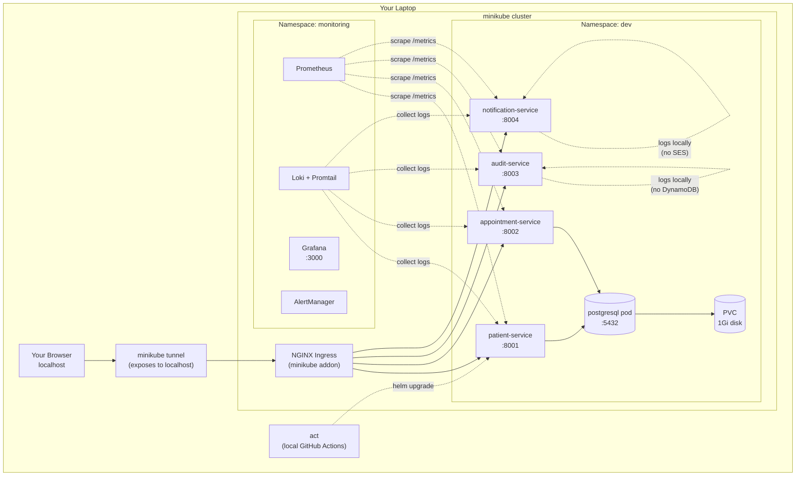
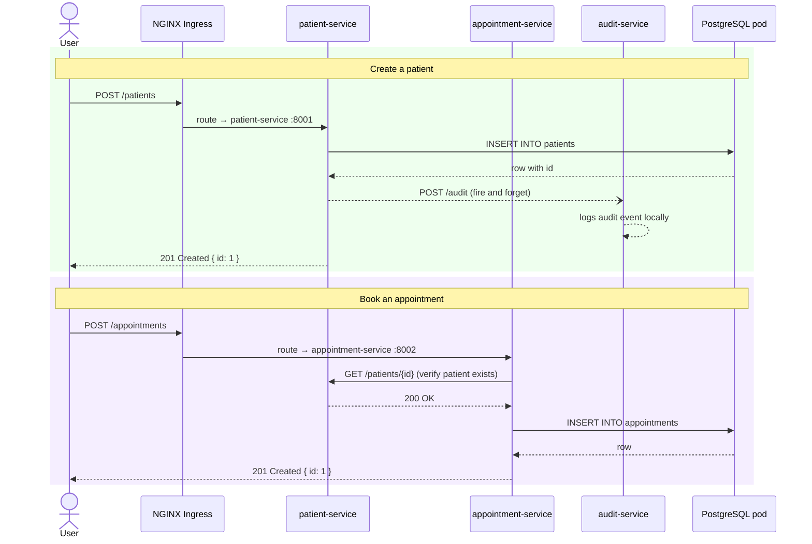
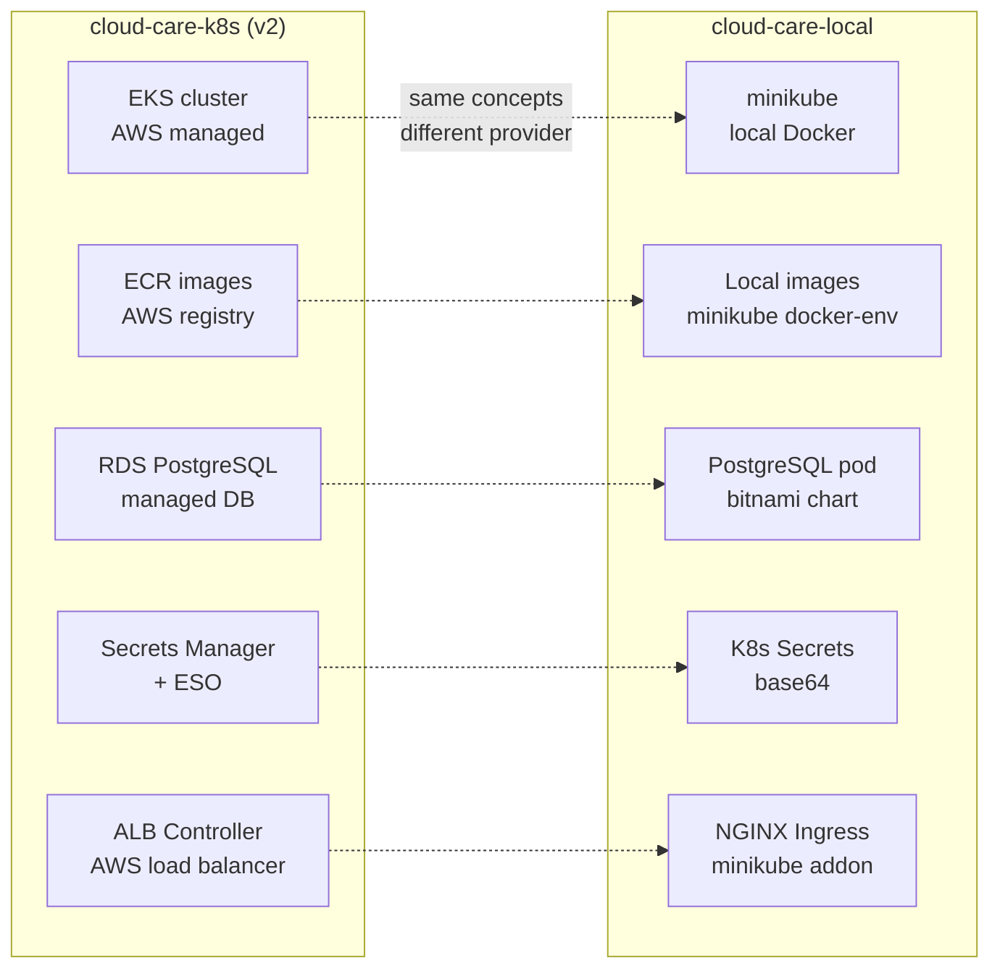

# cloud-care-local — Kubernetes Learning Lab

> **Learn Kubernetes hands-on with zero AWS cost.**
> Same 4 microservices from cloud-care-k8s, running locally on minikube.
> No cost pressure — go slow, break things, understand everything.

**Runtime** minikube · **Orchestration** Kubernetes 1.35 ·
**Backend** Python 3.12 + FastAPI (4 microservices) ·
**Observability** Prometheus + Grafana + Loki ·
**CI/CD** GitHub Actions + act (local runner)

---

## Purpose

In **cloud-care-k8s (v2)** everything ran on AWS EKS. Because EKS costs ~$5/day,
we moved fast and didn't have time to deeply understand each piece.

This project fixes that. Same services, same Helm charts, same observability stack —
but running on minikube on your laptop. Free. You can spend as much time as you want
on each phase without worrying about the bill.

---

## How this differs from cloud-care-k8s

| Concern | cloud-care-k8s (v2) | cloud-care-local |
|---------|-------------------|-----------------|
| Cluster | AWS EKS (~$5/day) | minikube (free) |
| Nodes | 3× t3.small EC2 | 1 minikube node (Docker) |
| Images | Pushed to AWS ECR | Built directly into minikube |
| Ingress | AWS ALB Controller | NGINX Ingress (minikube addon) |
| Database | RDS PostgreSQL | PostgreSQL pod (bitnami Helm chart) |
| Secrets | AWS Secrets Manager + ESO | Plain Kubernetes Secrets |
| DNS | Real ALB hostname | `localhost` via `minikube tunnel` |
| CI/CD | GitHub Actions (cloud runners) | `act` (local GitHub Actions runner) |
| Cost | ~$5/day | $0 |

---

## Architecture



---

## Microservices

| Service | Port | Stores data in | Local difference |
|---------|------|---------------|-----------------|
| `patient-service` | 8001 | PostgreSQL pod | Same as prod |
| `appointment-service` | 8002 | PostgreSQL pod | Same as prod |
| `audit-service` | 8003 | ~~DynamoDB~~ | Logs locally (no AWS) |
| `notification-service` | 8004 | ~~SES~~ | Logs emails (no AWS) |

---

## Request flow



---

## Learning phases

```mermaid
flowchart LR
    P0["Phase 0\nSetup\nminikube start"] -->
    P1["Phase 1\nkubectl\nraw YAML"] -->
    P2["Phase 2\nDatabase\nPostgreSQL pod"] -->
    P3["Phase 3\nHelm\ninstall/upgrade/rollback"] -->
    P4["Phase 4\nIngress\nNGINX routing"] -->
    P5["Phase 5\nObservability\nGrafana dashboards"] -->
    P6["Phase 6\nHPA\nlive scaling"] -->
    P7["Phase 7\nCI/CD\nact local runner"]

    style P0 fill:#dbeafe,stroke:#1d4ed8,color:#000
    style P1 fill:#dcfce7,stroke:#16a34a,color:#000
    style P2 fill:#fef9c3,stroke:#ca8a04,color:#000
    style P3 fill:#fce7f3,stroke:#db2777,color:#000
    style P4 fill:#ede9fe,stroke:#7c3aed,color:#000
    style P5 fill:#ffedd5,stroke:#ea580c,color:#000
    style P6 fill:#cffafe,stroke:#0891b2,color:#000
    style P7 fill:#f0fdf4,stroke:#15803d,color:#000
```



| Phase | Topic | Doc | Time |
|------:|-------|-----|------|
| 0 | Setup — minikube, addons | [01-setup.md](docs/01-setup.md) | 1 day |
| 1 | Raw kubectl — pods, deployments, services | [02-kubectl-basics.md](docs/02-kubectl-basics.md) | 2 days |
| 2 | Database — PostgreSQL pod, PVC, Secrets | [03-database.md](docs/03-database.md) | 1 day |
| 3 | Helm — install, upgrade, rollback, template | [04-helm.md](docs/04-helm.md) | 2 days |
| 4 | Ingress — NGINX routing, minikube tunnel | [05-ingress.md](docs/05-ingress.md) | 1 day |
| 5 | Observability — Prometheus, Grafana, Loki | [06-observability.md](docs/06-observability.md) | 3 days |
| 6 | HPA — auto-scaling under load | [07-hpa.md](docs/07-hpa.md) | 1 day |
| 7 | CI/CD — GitHub Actions locally with act | [08-cicd.md](docs/08-cicd.md) | 2 days |

**Total: ~2 weeks at your own pace. Zero cost.**

---

## Repository structure

```
cloud-care-local/
│
├── README.md
│
├── docs/                        ← one doc per phase, created as you progress
│   ├── 00-roadmap.md
│   ├── 01-setup.md
│   ├── 02-kubectl-basics.md
│   ├── 03-database.md
│   ├── 04-helm.md
│   └── ...                      ← more added as phases complete
│
├── services/                    ← copied from cloud-care-k8s (same code)
│   ├── patient-service/
│   ├── appointment-service/
│   ├── audit-service/
│   ├── notification-service/
│   └── docker-compose.yml       ← local dev without minikube
│
├── helm/                        ← copied from cloud-care-k8s
│   ├── patient-service/
│   │   ├── Chart.yaml
│   │   ├── values.yaml
│   │   ├── values-local.yaml    ← local overrides (no ECR, no IRSA)
│   │   └── templates/
│   ├── appointment-service/
│   ├── audit-service/
│   └── notification-service/
│
├── k8s/                         ← raw YAML written in Phase 1 & 2
│   ├── patient-service-deployment.yaml
│   └── patient-service-service.yaml
│
└── monitoring/                  ← copied from cloud-care-k8s (Phase 5)
    ├── prometheus/
    │   ├── values.yaml
    │   └── alerts.yaml
    └── loki/
        └── values.yaml
```

---

## Quick reference — most used commands

```bash
# Cluster
minikube start --cpus=4 --memory=4096 --driver=docker
minikube stop
minikube status
minikube dashboard        # web UI

# Pods
kubectl get pods -n dev
kubectl get pods -n dev -w                          # watch in real time
kubectl describe pod <name> -n dev                  # debug failing pod
kubectl logs <pod> -n dev                           # see logs
kubectl exec -it <pod> -n dev -- bash              # get inside pod

# Deployments
kubectl apply -f k8s/patient-service-deployment.yaml
kubectl scale deployment patient-service -n dev --replicas=2
kubectl delete -f k8s/patient-service-deployment.yaml

# Helm
helm list -n dev                                    # all releases
helm upgrade --install patient-service helm/patient-service -n dev -f helm/patient-service/values-local.yaml
helm history patient-service -n dev                 # release history
helm rollback patient-service 1 -n dev             # rollback to revision 1
helm uninstall patient-service -n dev

# Access services
kubectl port-forward svc/patient-service 8001:8001 -n dev
minikube tunnel                                     # expose ingress to localhost

# Grafana (Phase 5)
kubectl port-forward svc/kube-prometheus-stack-grafana 3000:80 -n monitoring
# http://localhost:3000  admin / cloudcare-grafana
```

---

## Key difference from cloud-care-k8s — why learn both?



The Kubernetes concepts are identical. What changes is the AWS-specific layer.
Understanding both makes you able to work on any cloud provider.

---

<sub>Part of the CloudCare portfolio — v1 (EC2/ASG) → v2 (EKS) → local (minikube learning lab).
Built for hands-on Kubernetes learning targeting SRE/DevOps interviews.</sub>
